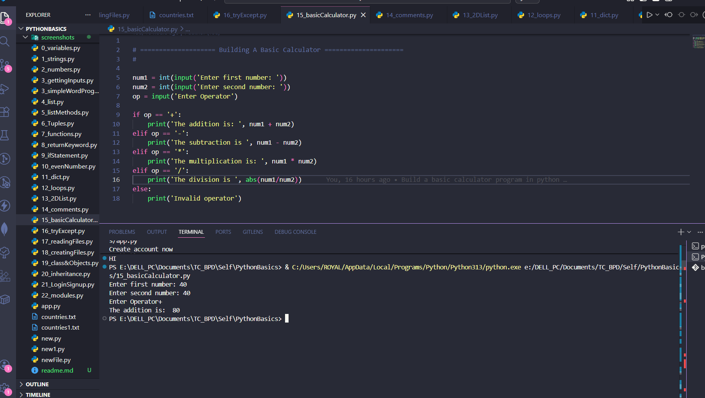
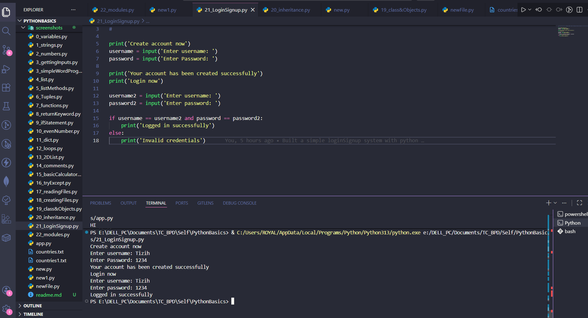
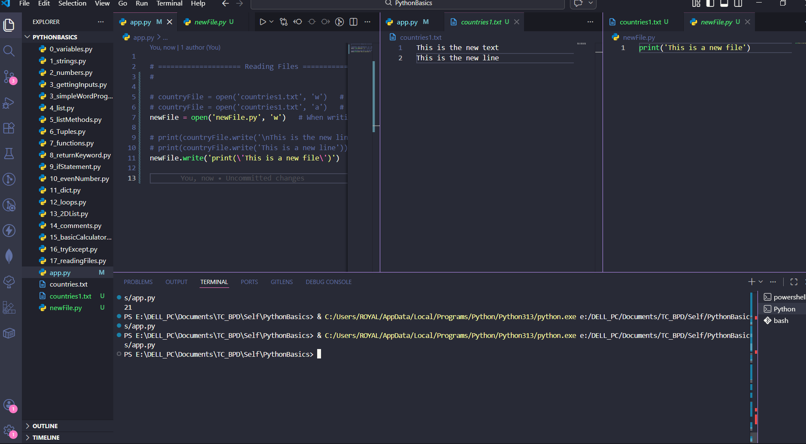

# Python Basics: My Backend Development Foundation With 🐍


## Welcome to my **Python Basics Repository**

**3.5 hours. One crash course. One giant leap into backend development.**

During my internship, I dedicated myself to mastering the fundamentals of Python—the language that powers some of the world's most robust backend systems. This project documents everything I learned during my backend development internship, where I spent over 3.5 hours mastering the foundation of Python. It has set a solid foundation that I'm now taking forward into Django.

This repository is a **time capsule** of everything I learned: clean code, working examples, and the confidence to build real applications.

## Here's a snapshot of the concepts I explored and coded:

### Core Building Blocks
| Concept | What I Built |
|--------|--------------|
| **Variables, Strings & Numbers** | Basic data handling and manipulation |
| **Getting Input** | Interactive terminal programs |
| **Lists & List Methods** | Organized data structures with `.append()`, `.remove()`, and more |
| **Tuples** | Immutable sequences for fixed data |
| **2D Lists** | Grid-like data structures |
| **Dictionaries** | Key-value pairs for real-world data mapping |

### Logic & Control Flow
| Concept | What I Built |
|--------|--------------|
| **If Statements** | Decision-making logic |
| **Loops (for/while)** | Repetitive tasks made efficient |
| **Even Number Program** | Practical condition + loop combination |

### Functions & Error Handling
| Concept | What I Built |
|--------|--------------|
| **Functions & `return`** | Reusable, modular code |
| **Try/Except Blocks** | Bulletproof programs that don't crash |

### File Handling & OOP
| Concept | What I Built |
|--------|--------------|
| **Reading & Creating Files** | Persistent data storage |
| **Classes & Objects** | Blueprint for real-world modeling |
| **Inheritance** | Reusing and extending functionality |

### Real-World Projects
| Concept | What I Built |
|--------|--------------|
| **Simple Word Program** | String manipulation mini-app |
| **Basic Calculator** | Arithmetic operations with input validation |
| **Login & Signup Program** | Simple user authentication system |
| **Modules Basics** | Organizing code across files |

### Utilities
- **Comments** — Documented code for clarity
- **Try/Except** — Robust error handling

## Why This Matters

Because backend development isn't just about knowing syntax—it's about understanding how pieces fit together. This crash course gave me:

✅ **Confidence** to tackle Django next  
✅ **Clean code habits** with comments and structure  
✅ **Practical projects** that mirror real-world logic  
✅ **A GitHub portfolio** that shows my growth path  

Every folder in this repo represents a concept I practiced, broke, fixed, and understood. This isn't theory—it's hands-on learning.

### Repository Structure
python-basics-backend/
│
├── 01_variables_strings_numbers/
├── 04_lists_and_methods/
├── 06_tuples/
├── 07_functions_and_return/
├── 09_if_statements_even_number/
├── 11_dictionaries/
├── 12_loops_2d_lists/
├── 15_calculator_try_except/
├── 17_file_handling/
├── 19_classes_objects_inheritance/
├── 21_login_signup/
├── 22_modules/
│
└── README.md

## Program Outputs

### Basic Calculator


### Login & Signup System


### File Handling Example


### How to Explore
1. Clone this repository:
```bash
git clone https://github.com/TIZIHMARKP/python-basics-backend.git
cd PYTHONBASICS
```

### What's Next
This foundation is now leading me into:

Django — Building full-stack web apps
REST APIs — Connecting backend to frontend
Databases — PostgreSQL with Django ORM

#### Repo By TIZIH MARK, today 23/03/2026
